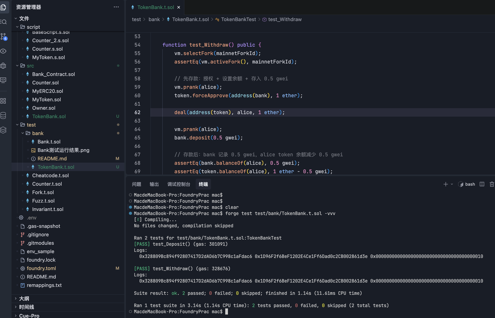

# Bank 合约测试说明

本目录存放 [`Bank`](../../src/Bank_Contract.sol) 合约的 Foundry 单元测试。

## 被测合约简介

`Bank` 是一个简单的存款合约，核心功能：

- **存款**：用户通过 `deposit()` 或直接向合约转 ETH（触发 `receive()`）存款，金额累加到 `deposits[msg.sender]`。
- **Top 3 存款榜**：内部维护 `topDepositors`（前 3 名地址数组），每次存款后自动重新排序。
- **管理员提取**：部署者为 `admin`，仅 `admin` 可调用 `withdraw()` 提走合约全部余额。
- **管理员变更**：`admin` 可通过 `setAdmin()` 转移权限，并触发 `AdminChanged` 事件。

## 测试文件

- [`Bank.t.sol`](./Bank.t.sol) — `BankTest` 合约，包含 3 个测试用例。

## 测试用例

| 测试函数 | 验证内容 |
| --- | --- |
| `testDeposit` | 存款前后 `deposits(user)` 余额正确累加（含多次存款）。 |
| `testTopDepositors` | 覆盖 5 个场景：1~4 个用户存款、同一用户多次存款时，`getTopDepositors()` 返回的前 3 名地址与金额均正确。 |
| `testWithdrawOnlyAdmin` | 非管理员调用 `withdraw()` 应 revert `"Only admin can withdraw"`；管理员调用后合约余额清零、admin 余额增加对应金额。 |

## 测试环境（setUp）

- 使用 `makeAddr` 创建 4 个测试用户 `user1`~`user4`。
- 用 `vm.deal` 给每个用户预置 10 ETH。
- 部署 `Bank`，合约的 `admin` 即测试合约自身（`address(this)`）。
- 测试合约实现 `receive()` 以接收 ETH（用于管理员提取后的余额校验）。

## 运行方式

在项目根目录执行：

```shell
# 运行本目录下所有测试
forge test --match-path "test/bank/*"

# 仅运行 BankTest
forge test --match-contract BankTest

# 运行单个测试用例（-vv 控制日志详细度）
forge test --match-test testTopDepositors -vvv

# 直接指定测试文件运行（-vv 控制日志详细度）
forge test test/bank/Bank.t.sol -vv
```

## 测试运行结果

执行 `forge test --match-path "test/bank/*" -vv` 的输出：

```text
No files changed, compilation skipped

Ran 3 tests for test/bank/Bank.t.sol:BankTest
[PASS] testDeposit() (gas: 84785)
[PASS] testTopDepositors() (gas: 278823)
[PASS] testWithdrawOnlyAdmin() (gas: 86551)
Suite result: ok. 3 passed; 0 failed; 0 skipped; finished in 1.51ms (794.42µs CPU time)

Ran 1 test suite in 798.04ms (1.51ms CPU time): 3 tests passed, 0 failed, 0 skipped (3 total tests)
```

| 用例 | 结果 | Gas |
| --- | --- | --- |
| `testDeposit` | PASS | 84,785 |
| `testTopDepositors` | PASS | 278,823 |
| `testWithdrawOnlyAdmin` | PASS | 86,551 |

合计：3 通过 / 0 失败 / 0 跳过，单套件耗时 1.51ms。

## 用到的关键 Cheatcode

- `makeAddr(name)`：生成确定性测试地址。
- `vm.deal(addr, amount)`：给地址设置 ETH 余额。
- `vm.prank(addr)`：将下一次调用的 `msg.sender` 设为指定地址。
- `vm.expectRevert(msg)`：断言下一次调用 revert 并匹配错误信息。

---

# TokenBank 合约测试说明

本目录存放 [`TokenBank`](../../src/TokenBank.sol) 合约的 Foundry 单元测试。

## 被测合约简介

`TokenBank` 是一个 ERC20 代币存款合约，核心功能：

- **存款**：用户先 `approve` 授权后调用 `deposit()`，代币从用户转入合约，金额累加到 `deposits[msg.sender]`。
- **取款**：用户调用 `withdraw()` 提取代币，先扣减存款记录再转出，防止重入攻击。
- **余额查询**：`balanceOf(user)` 返回用户在银行中的存款余额。
- **安全转账**：使用 OpenZeppelin `SafeERC20` 处理非标准 ERC20（如 USDT 不返回 `bool`）。

## 测试文件

- [`TokenBank.t.sol`](./TokenBank.t.sol) — `TokenBankTest` 合约，包含 2 个测试用例。

## 测试用例

| 测试函数 | 验证内容 |
| --- | --- |
| `test_Deposit` | 授权 + 设置余额 + 存入 0.5 gwei，验证 `balanceOf(alice)` 为 0.5 gwei。 |
| `test_Withdraw` | 先存入 0.5 gwei，再依次验证：提取 0 金额 revert、提取超额 revert、正常提取 0.3 gwei 后三方余额（bank 记录、alice token 余额、bank 合约持有量）正确变化。 |

## 测试环境（setUp）

- 使用 `vm.createSelectFork` 在主网区块 `25477500` 创建 fork，测试真实的 USDT（`0xdAC17F958D2ee523a2206206994597C13D831ec7`）。
- 使用 `makeAddr` 创建测试用户 `alice`、`bob`，`mike` 设为固定地址 `0x10`。
- 部署 `TokenBank`，传入 USDT 地址作为底层代币。
- 使用 `using SafeERC20 for IERC20` 以支持 USDT 的非标准接口。

## 关键技术点

- **USDT 非标准 ERC20**：USDT 的 `approve`/`transfer`/`transferFrom` 不返回 `bool`，直接调用会因 ABI 解码失败而 revert。测试中用 `token.forceApprove()` 代替 `token.approve()`；合约中用 `safeTransferFrom`/`safeTransfer` 代替原生调用。
- **`deal` 设置代币余额**：`deal(address(token), alice, 1 ether)` 通过修改存储槽直接设置 alice 的 USDT 余额。
- **`vm.prank` 模拟用户**：每次调用 `bank.deposit()`/`bank.withdraw()` 前用 `vm.prank(alice)` 切换 `msg.sender`。

## 运行方式

在项目根目录执行：

```shell
# 仅运行 TokenBankTest
forge test --match-contract TokenBankTest

# 运行单个测试用例（-vvvv 显示完整调用栈）
forge test --match-test test_Withdraw -vvvv

# 直接指定测试文件运行
forge test test/bank/TokenBank.t.sol -vv
```

## 测试运行结果

执行 `forge test --match-path "test/bank/TokenBank.t.sol" -vv` 的输出：



```text
Ran 2 tests for test/bank/TokenBank.t.sol:TokenBankTest
[PASS] test_Deposit() (gas: 301091)
[PASS] test_Withdraw() (gas: 328676)
Suite result: ok. 2 passed; 0 failed; 0 skipped; finished in 11.70s (7.65ms CPU time)
Ran 1 test suite in 11.71s (11.70s CPU time): 2 tests passed, 0 failed, 0 skipped (2 total tests)
```

| 用例 | 结果 | Gas |
| --- | --- | --- |
| `test_Deposit` | PASS | 301,091 |
| `test_Withdraw` | PASS | 328,676 |

合计：2 通过 / 0 失败 / 0 跳过，单套件耗时 11.70s（含主网 fork RPC 请求）。

## 用到的关键 Cheatcode

- `vm.createSelectFork(rpc, block)`：创建并切换到主网 fork。
- `vm.selectFork(id)` / `vm.activeFork()`：切换 fork / 获取当前 fork id。
- `makeAddr(name)`：生成确定性测试地址。
- `deal(token, addr, amount)`：设置 ERC20 代币余额（修改存储槽）。
- `vm.prank(addr)`：将下一次调用的 `msg.sender` 设为指定地址。
- `vm.expectRevert(msg)`：断言下一次调用 revert 并匹配错误信息。
