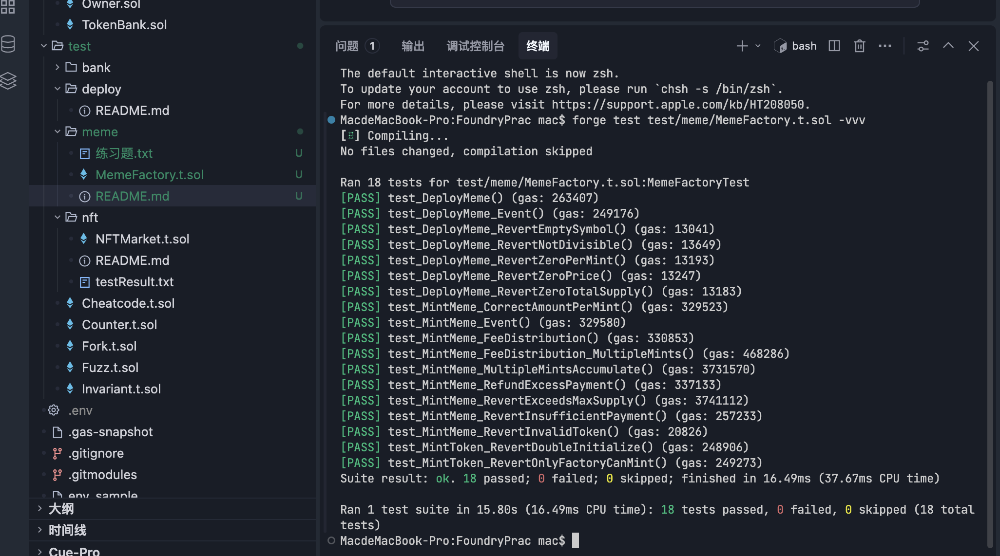

# Meme 发射平台测试说明

## 概述

Meme 发射平台由两个合约组成：

- **MemeToken** — ERC20 代币实现合约，作为最小代理（EIP-1167）的模板，所有代理实例共享代码但拥有独立存储
- **MemeFactory** — 工厂合约，通过 `Clones.clone()` 部署最小代理实例，管理铸造与费用分配

## 测试结果



18 个测试全部通过。

## 运行测试

```bash
# 运行全部 Meme 测试
forge test test/meme/MemeFactory.t.sol -vvv

# 运行单个测试
forge test test/meme/MemeFactory.t.sol --match-test test_MintMeme_FeeDistribution -vvv
```

## 测试环境

| 项目 | 值 |
|------|-----|
| Solidity | 0.8.30 |
| 框架 | Foundry (forge-std) |
| 依赖 | OpenZeppelin v5.5.0 |

### 测试账户

| 角色 | 说明 |
|------|------|
| `owner` | 项目方（即部署工厂合约的测试合约自身），接收 1% 铸造费用 |
| `issuer` | Meme 发行者，调用 `deployMeme` 创建代币，接收 99% 铸造费用 |
| `alice` | 普通用户，购买/铸造 Meme 代币 |
| `bob` | 预留的普通用户 |

### 测试常量

| 常量 | 值 | 说明 |
|------|-----|------|
| `TOTAL_SUPPLY` | 10,000 × 10¹⁸ | 代币总发行量 |
| `PER_MINT` | 100 × 10¹⁸ | 每次铸造数量 |
| `PRICE` | 0.01 ETH | 每次铸造费用 |

## 测试用例清单（18 个）

### 1. deployMeme 部署测试

| 测试函数 | 验证内容 |
|----------|----------|
| `test_DeployMeme` | 成功部署后代币参数（symbol、name、maxSupply、perMint、mintPrice、issuer、factory）正确设置，初始 totalSupply 为 0 |
| `test_DeployMeme_RevertEmptySymbol` | 空 symbol 字符串时 revert |
| `test_DeployMeme_RevertZeroTotalSupply` | totalSupply 为 0 时 revert |
| `test_DeployMeme_RevertZeroPerMint` | perMint 为 0 时 revert |
| `test_DeployMeme_RevertZeroPrice` | price 为 0 时 revert |
| `test_DeployMeme_RevertNotDivisible` | totalSupply 不能被 perMint 整除时 revert |

### 2. mintMeme 费用分配测试

| 测试函数 | 验证内容 |
|----------|----------|
| `test_MintMeme_FeeDistribution` | 单次铸造：1% 费用到项目方，99% 费用到发行者，金额精确计算 |
| `test_MintMeme_FeeDistribution_MultipleMints` | 5 次连续铸造后累计费用分配正确 |

**费用分配逻辑：**
```
projectFee = price / 100          // 1% 给项目方
issuerFee  = price - projectFee   // 99% 给发行者
```

### 3. 铸造数量与总量控制测试

| 测试函数 | 验证内容 |
|----------|----------|
| `test_MintMeme_CorrectAmountPerMint` | 单次铸造后 balanceOf 和 totalSupply 各增加 perMint |
| `test_MintMeme_MultipleMintsAccumulate` | 铸造 totalSupply / perMint 次后 totalSupply 达到上限 |
| `test_MintMeme_RevertExceedsMaxSupply` | totalSupply 耗尽后再次铸造 revert |

### 4. 安全性测试

| 测试函数 | 验证内容 |
|----------|----------|
| `test_MintMeme_RevertInsufficientPayment` | 支付金额不足时 revert |
| `test_MintMeme_RevertInvalidToken` | 对非工厂创建的地址调用 mintMeme revert |
| `test_MintMeme_RefundExcessPayment` | 多付的 ETH 自动退还，实际仅扣除 price |
| `test_MintToken_RevertOnlyFactoryCanMint` | 直接调用 MemeToken.mint（非工厂调用）revert |
| `test_MintToken_RevertDoubleInitialize` | 重复调用 initialize revert |

### 5. 事件测试

| 测试函数 | 验证内容 |
|----------|----------|
| `test_DeployMeme_Event` | 部署时触发 `MemeDeployed` 事件，校验 issuer、symbol、supply 等字段 |
| `test_MintMeme_Event` | 铸造时触发 `MemeMinted` 事件，校验 tokenAddr、minter、amount、fee |

## 合约事件参考

```solidity
event MemeDeployed(
    address indexed tokenAddr,
    address indexed issuer,
    string symbol,
    uint256 totalSupply,
    uint256 perMint,
    uint256 price
);

event MemeMinted(
    address indexed tokenAddr,
    address indexed minter,
    uint256 amount,
    uint256 fee
);
```

## 注意事项

- 测试合约自身作为 `owner`（项目方），需要实现 `receive()` 以接收 ETH 费用
- 最小代理模式下，MemeToken 的 `constructor` 不会在代理实例中执行，因此 `name` 和 `symbol` 通过 `initialize()` 设置
- MemeToken 重写了 `name()` 和 `symbol()` 函数，使用自定义存储变量而非 ERC20 基类的 `_name` / `_symbol`（因后者为 private 且仅在构造函数中赋值）
