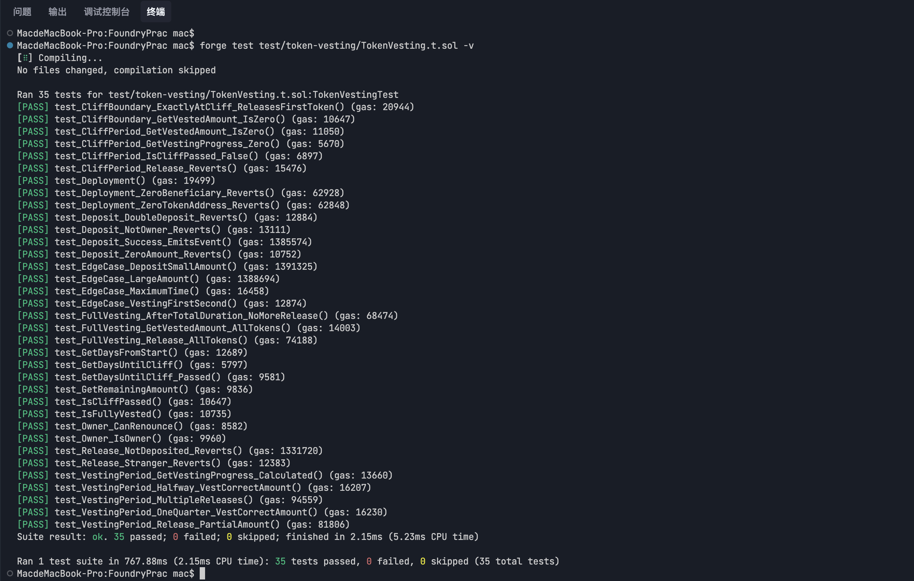

# TokenVesting 合约测试

> 测试文件：[TokenVesting.t.sol](./TokenVesting.t.sol)
> 被测合约：[src/token-vesting/Vesting.sol](../../src/token-vesting/Vesting.sol)

## 目录

- [概述](#概述)
- [合约机制](#合约机制)
- [测试架构](#测试架构)
- [测试用例清单](#测试用例清单)
- [运行测试](#运行测试)
- [测试结果](#测试结果)
- [Mock 合约说明](#mock-合约说明)

---

## 概述

本目录包含对 `TokenVesting`（代币锁定释放）智能合约的 **35 个 Foundry 单元测试**。合约实现了标准的 **Cliff + 线性释放** 代币解锁机制，适用于团队激励、投资方锁仓等场景。

## 合约机制

### 释放时间线

```
部署 ──────── 12个月锁定期 ──────── 24个月线性释放 ──────── 全部解锁
  │              (Cliff)                  (Vesting)
  ▼              ▼                        ▼                        ▼
Day 0        Day 365                  Day 1095                 Day 1095+
┌────────────┬────────────────────────┬───────────────────────┐
│  0 可释放    │  按时间线性累计释放      │  全部可释放             │
│  锁仓中      │  day 366: 1/730 份     │  release() 领完        │
│             │  day 730: ~50%         │                       │
│             │  day 1095: 100%       │                       │
└────────────┴────────────────────────┴───────────────────────┘
```

### 核心公式

```solidity
// 线性释放期内的累计释放量
vestedAmount = totalAmount × (cliff后经过时间 / 730天)
```

使用 OpenZeppelin 的 `Math.mulDiv()`（512 位精度）避免乘法溢出。

### 关键角色

| 角色 | 权限 |
|------|------|
| **Owner**（部署者） | `deposit()` 存入代币、`renounceOwnership()` 放弃所有权 |
| **Beneficiary**（受益人） | `release()` 领取已解锁代币 |
| **Stranger**（任意地址） | 无任何权限 |

### 合约接口

| 函数 | 类型 | 说明 |
|------|------|------|
| `constructor(IERC20, address)` | 部署 | 锁定代币地址 + 受益人地址 |
| `deposit(uint256)` | Owner | 存入代币（仅一次） |
| `release()` | Beneficiary | 领取已解锁代币 |
| `getVestedAmount()` | View | 累计已释放量 |
| `getReleasableAmount()` | View | 当前可释放量 = vested − released |
| `getRemainingAmount()` | View | 未释放代币数 |
| `isCliffPassed()` | View | 是否已过锁定期 |
| `isFullyVested()` | View | 是否已完全解锁 |
| `getVestingProgress()` | View | 释放进度（基点 0~10000） |
| `getDaysFromStart()` | View | 距部署天数 |
| `getDaysUntilCliff()` | View | 距可释放剩余天数 |

---

## 测试架构

### 技术栈

- **Foundry** — Solidity 测试框架
- **forge-std** — 标准测试库（`Test`、`console`、`Vm`）
- **OpenZeppelin** — `IERC20`、`Ownable`、`Math`

### 测试参数

```solidity
TOTAL_AMOUNT   = 1_000_000 ether  // 1e24 代币
CLIFF_DURATION = 365 days         // 12 个月锁定期
VESTING_DURATION = 730 days       // 24 个月释放期
TOTAL_DURATION = 1095 days        // 36 个月总期限
```

### 测试初始化 (`setUp`)

```solidity
function setUp() public {
    owner       = address(this);                    // 测试合约自身
    beneficiary = makeAddr("beneficiary");          // 固定派生地址
    stranger    = makeAddr("stranger");             // 固定派生地址

    token   = new MyERC20("Test Token", "TT");      // 部署测试代币
    vesting = new TokenVesting(token, beneficiary); // 部署合约

    token.approve(address(vesting), TOTAL_AMOUNT);  // 授权
    vesting.deposit(TOTAL_AMOUNT);                  // 存入
}
```

每个测试函数执行前自动调用 `setUp()`，确保测试隔离。

### 核心测试技术

| 技术 | 用途 | 示例 |
|------|------|------|
| `vm.warp()` | 时间旅行 | 模拟 cliff 到期、释放期中途、完全解锁 |
| `vm.prank()` | 身份模拟 | 模拟 beneficiary / stranger 调用 |
| `vm.expectRevert()` | 预期回滚 | 验证权限校验、金额校验 |
| `vm.expectEmit()` | 预期事件 | 验证 `TokensDeposited`、`TokensReleased` |
| `assertApproxEqAbs()` | 近似比较 | 处理 `mulDiv` 整数截断误差 |

---

## 测试用例清单

### 1. 部署测试（3 个）

| # | 测试函数 | 场景 |
|---|---------|------|
| 1 | `test_Deployment` | 验证所有状态变量正确初始化 |
| 2 | `test_Deployment_ZeroTokenAddress_Reverts` | 零地址代币 → revert |
| 3 | `test_Deployment_ZeroBeneficiary_Reverts` | 零地址受益人 → revert |

### 2. 存款测试（4 个）

| # | 测试函数 | 场景 |
|---|---------|------|
| 4 | `test_Deposit_NotOwner_Reverts` | 非 owner 存款 → revert |
| 5 | `test_Deposit_ZeroAmount_Reverts` | 存款金额为 0 → revert |
| 6 | `test_Deposit_DoubleDeposit_Reverts` | 重复存款 → revert |
| 7 | `test_Deposit_Success_EmitsEvent` | 正常存款 → 发射 `TokensDeposited` |

### 3. Cliff 锁定期测试（4 个）

| # | 测试函数 | 场景 |
|---|---------|------|
| 8 | `test_CliffPeriod_GetVestedAmount_IsZero` | 锁定期内 vested=0, releasable=0 |
| 9 | `test_CliffPeriod_Release_Reverts` | 锁定期内 release() → revert |
| 10 | `test_CliffPeriod_IsCliffPassed_False` | `isCliffPassed()` = false，剩余 365 天 |
| 11 | `test_CliffPeriod_GetVestingProgress_Zero` | 释放进度 = 0% |

### 4. Cliff 边界测试（2 个）

| # | 测试函数 | 场景 |
|---|---------|------|
| 12 | `test_CliffBoundary_GetVestedAmount_IsZero` | cliff − 1 秒 → 释放量仍为 0 |
| 13 | `test_CliffBoundary_ExactlyAtCliff_ReleasesFirstToken` | cliff 到期瞬间 = 0；cliff + 1 秒 > 0 |

### 5. 线性释放期测试（5 个）

| # | 测试函数 | 场景 |
|---|---------|------|
| 14 | `test_VestingPeriod_Halfway_VestCorrectAmount` | 释放期过半 → ≈50% 总量 |
| 15 | `test_VestingPeriod_OneQuarter_VestCorrectAmount` | 释放期 1/4 → ≈25% 总量 |
| 16 | `test_VestingPeriod_Release_PartialAmount` | 中途 release() → 代币到账 + 状态归零 |
| 17 | `test_VestingPeriod_MultipleReleases` | 多次部分释放 → 累积正确 |
| 18 | `test_VestingPeriod_GetVestingProgress_Calculated` | 50% 进度 → 5000 基点 |

### 6. 完全释放测试（3 个）

| # | 测试函数 | 场景 |
|---|---------|------|
| 19 | `test_FullVesting_GetVestedAmount_AllTokens` | 到期 → 全部可释放，进度 10000 |
| 20 | `test_FullVesting_Release_AllTokens` | 全量 release → 受益人余额 = totalAmount |
| 21 | `test_FullVesting_AfterTotalDuration_NoMoreRelease` | 过期后再 release → 无额外代币 |

### 7. 访问控制测试（2 个）

| # | 测试函数 | 场景 |
|---|---------|------|
| 22 | `test_Release_Stranger_Reverts` | stranger 调用 release → revert |
| 23 | `test_Release_NotDeposited_Reverts` | 未存款合约 release → revert |

### 8. 视图函数测试（5 个）

| # | 测试函数 | 场景 |
|---|---------|------|
| 24 | `test_GetRemainingAmount` | `getRemainingAmount()` = totalAmount |
| 25 | `test_GetDaysFromStart` | 部署后第 0/1/100 天 |
| 26 | `test_GetDaysUntilCliff` | 锁定期内 = 365 天 |
| 27 | `test_GetDaysUntilCliff_Passed` | cliff 过后 = 0 天 |
| 28 | `test_IsCliffPassed` | cliff 前后布尔切换 |
| 29 | `test_IsFullyVested` | 总期限前后布尔切换 |

### 9. 边界条件测试（4 个）

| # | 测试函数 | 场景 |
|---|---------|------|
| 30 | `test_EdgeCase_VestingFirstSecond` | cliff + 1 秒 → 微量释放 |
| 31 | `test_EdgeCase_MaximumTime` | 远超期限（10 年后）→ 仍全量 |
| 32 | `test_EdgeCase_DepositSmallAmount` | 极小金额（2 wei）→ 正确计算 |
| 33 | `test_EdgeCase_LargeAmount` | 较大金额（900K ether）→ 无溢出 |

### 10. 所有权管理测试（2 个）

| # | 测试函数 | 场景 |
|---|---------|------|
| 34 | `test_Owner_IsOwner` | `owner()` = 部署者 |
| 35 | `test_Owner_CanRenounce` | `renounceOwnership()` → owner = address(0) |

---

## 运行测试

```bash
# 运行全部测试（简洁输出）
forge test test/token-vesting/TokenVesting.t.sol

# 运行指定测试，带详细日志
forge test test/token-vesting/TokenVesting.t.sol -vv

# 运行指定测试，带事件/调用栈追踪
forge test test/token-vesting/TokenVesting.t.sol -vvv

# 只运行某个测试
forge test test/token-vesting/TokenVesting.t.sol -vv --match-test test_VestingPeriod

# 重跑上次失败的测试
forge test --rerun
```

## 测试结果



```
Ran 1 test suite in 767.88ms (2.15ms CPU time):
  35 tests passed, 0 failed, 0 skipped (35 total tests)
```

## Mock 合约说明

### MyERC20

测试用 ERC20 代币，位于 `src/MyERC20.sol`：
- 继承 OpenZeppelin `ERC20`
- 初始供应量 1,000,000 × 10^18 给部署者
- 提供 `transferWithCallback()` 扩展功能

### TokenVesting

被测合约，位于 `src/token-vesting/Vesting.sol`：
- 继承 `Ownable`（OpenZeppelin）
- 使用 `Math.mulDiv()` 保证乘除运算精度
- 所有状态变量均为 `immutable`（`token`、`beneficiary`、`startTime`、`cliffDuration`、`vestingDuration`）或单字（`totalAmount`、`releasedAmount`），符合 EIP-170 部署模式
- 常量：`CLIFF_DURATION = 365 days`、`VESTING_DURATION = 730 days`、`TOTAL_DURATION = 1095 days`